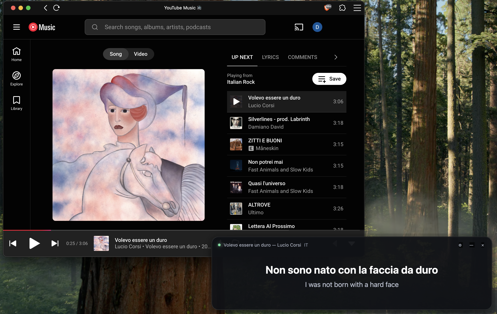

# Live Music Translator

An always-on-top, line-by-line lyrics translator for language learning. Live Music Translator follows the song playing on your computer, finds synchronized lyrics, detects their language, and shows the current line with an offline translation underneath.

[](LICENSE)
[](#platform-support)
[](#platform-support)
[](#platform-support)

## Screenshot



## Features

- Shows only the lyric line currently being sung—never a wall of lyrics.
- Displays the original lyric and a target-language translation together.
- Detects the lyric language automatically.
- Works with system media sessions instead of being tied to one music player.
- Uses YouTube Music timed lyrics with LRCLIB as a concurrent fallback.
- Runs translation locally with Gemma 4 E2B and native LiteRT-LM GPU acceleration.
- Preloads the model before showing the overlay, avoiding cold-start delays mid-song.
- Cancels obsolete requests and pre-translates upcoming lines for instant display.
- Captures no microphone or system audio.

## How it works

```text
System media session
        │
        ▼
Track metadata ──► YouTube Music / LRCLIB ──► synchronized lyric lines
                                                        │
                                                        ▼
                                         language detection + timing
                                                        │
                                                        ▼
                                native Gemma translation + look-ahead cache
                                                        │
                                                        ▼
                                            always-on-top Electron overlay
```

## Technology

| Area | Technology |
| --- | --- |
| Desktop application | Electron, Node.js, HTML, CSS, JavaScript |
| Local translation | Gemma 4 E2B (`gemma-4-E2B-it.litertlm`) |
| Native inference | LiteRT-LM C API with a small C++17 sidecar |
| Acceleration | Native GPU backend with automatic CPU fallback |
| Language detection | `franc-min` |
| Timed lyrics | YouTube Music web endpoints, LRCLIB fallback, LRC parsing |
| macOS playback | MediaRemote Now Playing, Apple Music and Spotify fallbacks |
| Windows playback | Global System Media Transport Controls via PowerShell/WinRT |
| Linux playback | MPRIS through `playerctl` |
| Packaging | Electron Builder |
| Testing | Node.js test runner plus native GPU smoke/stress tests |

## Platform support

- **macOS:** Apple silicon. Reads the system-wide Now Playing session, including compatible browsers and third-party players.
- **Windows 10/11:** x64. Reads players and browsers that publish a Windows system media session.
- **Linux:** x64 and ARM64. Reads MPRIS-compatible players and browsers; `playerctl` must be installed.

The native LiteRT-LM SDK currently determines the supported CPU/OS combinations.

## Quick start

### Requirements

- Node.js 20 or newer
- Around 3.1 GB of free disk space for the model and build files
- A C++17 compiler:
  - macOS: Xcode Command Line Tools
  - Windows: Visual Studio Build Tools 2022 with C++ support
  - Linux: GCC/G++
- Linux only: `playerctl`

```bash
npm install
npm start
```

The first development run downloads and verifies the pinned 2.59 GB Gemma model and LiteRT-LM SDK, then compiles the native helper. Packaged releases include the model and runtime already.

## Usage

1. Start Live Music Translator and wait for the overlay to appear. The model is fully preloaded first.
2. Play a song in any player that publishes system media metadata.
3. Open the gear menu and choose the language you understand.
4. Adjust timing in 0.25-second increments if a recording is slightly early or late.

For example, when learning Italian, play an Italian song and select English. The overlay shows each Italian line with its English translation as it is sung.

## Tests

```bash
npm test
npm run smoke:translation
```

The unit suite covers lyric parsing and matching, playback adapters, model integrity, translation caching, cancellation, and YouTube Music timed-lyric parsing. The smoke test loads the real native model and verifies GPU translation, latest-line cancellation, look-ahead prefetch, and cached display latency.

## Build installers

```bash
npm run dist
```

Electron Builder creates installers for the current platform in `dist/`. Build on macOS, Windows, and Linux separately for native releases. The unpacked application is roughly 2.8 GB because the model is bundled for fully local translation.

Model and SDK downloads are pinned by exact byte size and SHA-256 checksum in the build scripts. Generated models, SDK files, installers, and native binaries are excluded from Git.

## Privacy and network access

- Translation is performed locally. Lyric text is not sent to a translation API.
- The application does not listen to or record audio.
- Track title, artist, album, and duration are sent to YouTube Music and LRCLIB to locate synchronized lyrics.
- Lyrics are held in application memory and are not committed to this repository.

YouTube Music's web endpoints are unofficial and may change. Live Music Translator is not affiliated with Google, YouTube, LRCLIB, Spotify, Apple, or Microsoft.

## Project structure

```text
native/                 C++ LiteRT-LM translation helper
scripts/                verified model/SDK preparation and smoke tests
src/core/               lyrics, language detection, translation and caching
src/playback/           macOS, Windows and Linux media-session adapters
src/renderer/           secure always-on-top overlay UI
src/translation/        native helper process host
test/                   dependency-light unit tests
```

## License

The application source is available under the [MIT License](LICENSE). Third-party runtimes, models, services, and generated artifacts retain their own licenses and terms; see [THIRD_PARTY_NOTICES.md](THIRD_PARTY_NOTICES.md).

## Support

If Live Music Translator helps with your language learning, you can support continued development:

<a href="https://ko-fi.com/U2P428BPKQ" target="_blank"></a>

GitHub sanitizes executable `<script>` tags in README files, so the Ko-fi widget is represented by the official clickable Ko-fi image instead.
